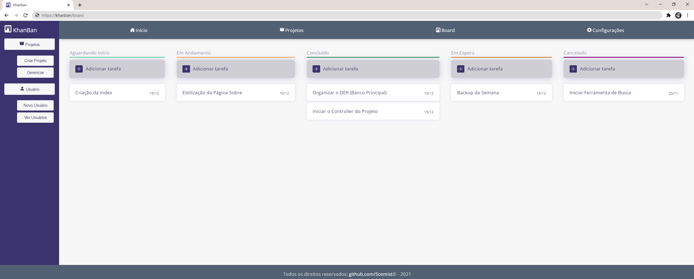

# Um sistema Kanban feito em Laravel, JavaScript e CSS.

	

## To Clone

1. Clone the project with `git clone https://github.com/Scemist/Khanban.git`
2. Inside *khanban* folder, run `composer install` for the vendor components
3. Create the database in your *pgadmin*
4. Make a copy of `.env.example` with name `.env` only and insert your databases credentials
5. Run `php artisan migrate` in project folder
6. Run `php artisan serve` to run the server and access by `localhost`

## Versões

> Laravel Framework **8.77.1**
> 
> PHP **8.1.1**
> 
> Composer **2.2.3**
> 
> PostgreSQL **14.0**

## Projeto

<table>
  <tr>
    <th>Público</th>
    <th colspan="2">Restrito</th>
  </tr>
  <tr>
  	<th>Home</th>
    <th>Início</th>
    <th>Projeto</th>
  </tr>
  <tr>
  	<td>Index</td>
    <td>Projetos</td>
    <td>Board</td>
  </tr>
  <tr>
  	<td>Login</td>
    <td>Conta</td>
    <td>Tarefa</td>
  </tr>
  <tr>
  	<td>Sobre</td>
    <td>Perfil</td>
    <td>Preferências Projeto</td>
  </tr>
  <tr>
  	<td>Cadastro</td>
    <td>Novo Projeto</td>
    <td></td>
  </tr>
  <tr>
  	<td></td>
    <td></td>
    <td></td>
  </tr>
</table>

## Sobre o Framework Laravel

The Laravel framework is open-sourced software licensed under the [MIT license](https://opensource.org/licenses/MIT).
