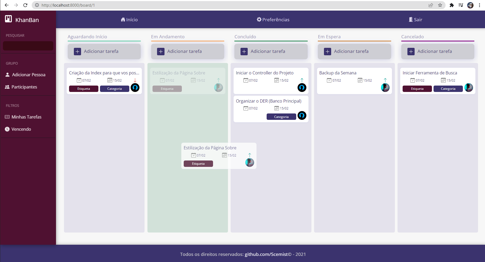

# Um sistema Kanban feito em Laravel, JavaScript e CSS apenas.

## To Run In Your PC

1. Clone the project with `git clone https://github.com/Scemist/Khanban.git`
2. In root directory, run `composer install` for the vendor components
3. Create the database in your *pgadmin*
4. Make a copy of `.env.example` with name `.env` only and insert your databases credentials
5. Run `php artisan migrate --seed` in root directory
6. Run `php artisan serve` to run the server and access by `localhost:8000` (or the port)
7. In the login page of application, the email is **admin@admin.com** and the password is **admin** (this data was added by `--seed` in step 5)

### To Develop

1. Run `npm run watch` in a separated terminal, so you'll be able to edit assets in */resources* and the _Laravel Mix_ will compile to */public* folder in each modification

## Versões

> Laravel Framework **9.0.2**
> 
> PHP **8.1.2**
> 
> Composer **2.2.3**
> 
> PostgreSQL **14.0**

## Projeto

A branch **master** é um sistema Kanban fechado.

A branch **public** é uma versão onde o Kanban é um website kanban público.

### Branch **master**

* Login
* Index
  * Projetos
  * Novo Projeto
  * Conta
  * Perfil
  * Cadastro de Usuário
* Dashboard
  * Tarefa
  * Preferencias do Projeto

### Branch **public**

<table>
  <tr>
    <th>Público</th>
    <th colspan="2">Restrito</th>
  </tr>
  <tr>
  	<th>Home</th>
    <th>Início</th>
    <th>Projeto</th>
  </tr>
  <tr>
  	<td>Index</td>
    <td>Projetos</td>
    <td>Board</td>
  </tr>
  <tr>
  	<td>Login</td>
    <td>Conta</td>
    <td>Tarefa</td>
  </tr>
  <tr>
  	<td>Sobre</td>
    <td>Perfil</td>
    <td>Preferências Projeto</td>
  </tr>
  <tr>
  	<td>Cadastro</td>
    <td>Novo Projeto</td>
    <td></td>
  </tr>
</table>

## Sobre o Framework Laravel

The Laravel framework is open-sourced software licensed under the [MIT license](https://opensource.org/licenses/MIT).
